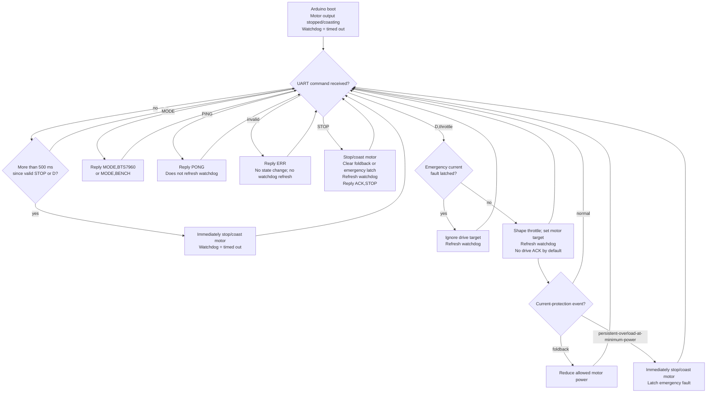
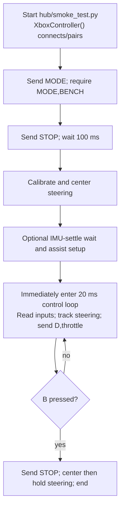

# Current start, pairing, and arming flow

**Status: descriptive.** This is a behavior map of the current implementation,
not an independent specification. The normative documents are linked from the
repository [`README.md`](README.md).

This is a behavior map of the current firmware, not a proposal. Edit the
Mermaid source below (node labels and arrows) or add notes in the **Requested
changes** section. I can then implement the revised flow.

Scope: production uses `hub/main.py` with the `uno_bts7960` Arduino build.
The smoke-test variation is shown separately.

## Production flow

```mermaid
flowchart TD
    power["Power Arduino, Technic Hub, then motor power"] --> arduinoBoot
    arduinoBoot["Arduino boots<br/>- Motor driver initialized stopped/coasting<br/>- Vehicle stopped<br/>- Watchdog starts timed out<br/>- Sends READY over UART"] --> hubStart

    hubStart["Start hub/main.py"] --> xbox["XboxController() waits for controller connection<br/>First run: controller pairing happens here<br/>Later runs: auto-connect"]
    xbox --> modeRequest["Hub clears UART buffer<br/>and sends MODE"]
    modeRequest --> modeReply{"Arduino replies<br/>MODE,BTS7960?"}
    modeReply -- no / timeout --> exitEarly["Program exits via finally<br/>Arduino remains stopped<br/>Watchdog is fallback"]
    modeReply -- yes --> initialStop["Hub sends STOP<br/>waits 100 ms; drains UART"]

    initialStop --> calibration["Steering calibration while drive is stopped<br/>1. Run to left stall at limited duty<br/>2. Wait 250 ms<br/>3. Run to right stall at limited duty<br/>4. Validate travel and limits<br/>5. Move to midpoint and reset angle to zero"]
    calibration --> calibrationOk{"Calibration valid?"}
    calibrationOk -- no --> exitEarly
    calibrationOk -- yes --> imu["If gyro assist enabled:<br/>wait up to 1 s for IMU ready<br/>then create assist controller"]

    imu --> unarmed["UNARMED"]
    unarmed --> unarmedLoop["Every 20 ms:<br/>- Read buttons, triggers, steering<br/>- Track steering target<br/>- Apply gyro assist if enabled<br/>- Send STOP to Arduino<br/>- Drain UART"]
    unarmedLoop --> bUnarmed{"B pressed?"}
    bUnarmed -- yes --> shutdown
    bUnarmed -- no --> armCheck{"Fresh A press<br/>AND both triggers at most 2?"}
    armCheck -- no --> unarmedLoop
    armCheck -- yes --> limitedArmed["ARMED: LIMITED-POWER MODE<br/>Maximum drive command is 75%<br/>Set Technic Hub light blue"]

    limitedArmed --> limitedLoop["Every 20 ms:<br/>- Keep net trigger -2..2 neutral<br/>- Remap 3..100% intent onto 10..75% drive<br/>- B exits<br/>- Read triggers and steering<br/>- Track steering target, with optional assist<br/>- Send D,throttle<br/>- Drain UART"]
    limitedLoop --> bLimited{"B pressed?"}
    bLimited -- yes --> shutdown
    bLimited -- no --> fullPowerCheck{"LB and RB<br/>pressed together?"}
    fullPowerCheck -- no --> limitedLoop
    fullPowerCheck -- yes --> fullArmed["ARMED: FULL-POWER MODE<br/>Maximum drive command is 100%<br/>Set Technic Hub light red"]

    fullArmed --> fullLoop["Every 20 ms:<br/>- Keep net trigger -2..2 neutral<br/>- Remap 3..100% intent onto 10..100% drive<br/>- Read triggers and steering<br/>- Track steering target, with optional assist<br/>- Send D,throttle<br/>- Drain UART"]
    fullLoop --> bFull{"B pressed?"}
    bFull -- no --> fullLoop
    bFull -- yes --> limitedArmed

    shutdown["Finally:<br/>- Center steering when calibrated<br/>- Send STOP; ignore UART write failure<br/>- Wait 500 ms and hold steering<br/>Arduino also coasts if its watchdog expires"] --> finished(["Program ends"])
```

## Arduino command and safety state

Notes:

- The `READY` packet is informational in the present Hub programs: neither Hub
  program waits for it. Each instead sends `MODE` and waits for the matching
  response, so startup succeeds if the Arduino has already finished booting.
- The production `STOP` packets continue throughout the unarmed loop. They
  also clear current protection each frame; therefore an Arduino current fault
  cannot remain latched while the Hub is unarmed.
- `A` must transition from released to pressed after reaching the unarmed loop.
  Holding A during calibration does not arm. Both triggers must read at most 2
  at the arm check. A successful arm starts **limited-power mode**, which caps
  the drive command at 75%.
- While in limited-power mode, pressing the Xbox controller's `LB` and `RB`
  shoulder buttons together switches to full-power mode (100% maximum) and
  changes the Technic Hub light to red. Pressing `B` once from full-power mode
  returns to limited-power mode and changes the Hub light back to blue. A
  further `B` press while in limited-power mode stops the car and exits.
- Production trigger compensation keeps net intent `-2..2` at zero. Each
  remaining trigger position is remapped across the usable range: `-3` and `3`
  become the measured `-10` and `10` launch commands, while full trigger
  reaches the active 75-command or 100-command mode maximum.
- On an Arduino reset or broken UART link, the Arduino watchdog prevents
  ongoing drive after 500 ms. It starts in the stopped state.
- The physical emergency/motor-power switch is outside the software flow.

## Smoke-test differences (`hub/smoke_test.py` + `uno_bench`)

Unlike production, smoke test has no A-button arm gate and has no drive-direction
inversion (`throttle = right trigger - left trigger`). Its Arduino backend
prints motor diagnostics instead of driving the BTS7960.

## Requested changes

Replace this text with the desired state names, transitions, button actions,
timeouts, and safety conditions. You can also edit any Mermaid code block
directly.

<!-- Describe desired changes here. -->
