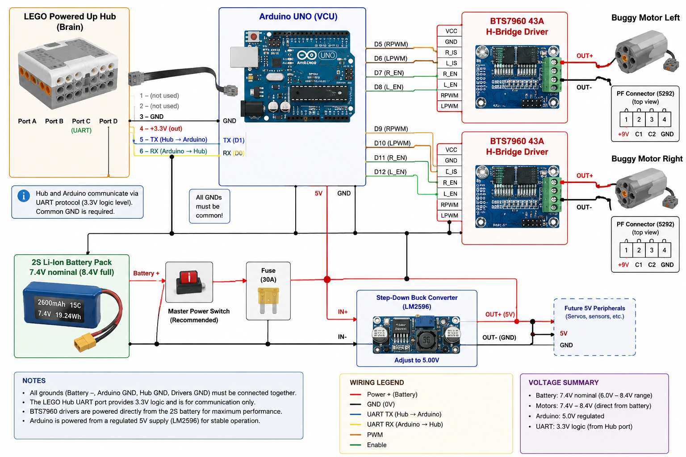

# LEGO Technic RC Vehicle Controller



Firmware for an Arduino UNO between a LEGO Technic Hub and one BTS7960 motor
driver. The two side-by-side buggy motors share the bridge with opposite
polarity, so they spin in opposite directions.

> [!WARNING]
> This documented vehicle revision has **no independent system-level hardware
> current protection**: no externally rated fuse, independent protection
> circuit, or automatic vehicle-level motor-power cutoff. The BTS7960 driver IC
> has integrated device-level protections, but they are not a substitute for
> independent vehicle protection. Firmware foldback and the driver IC cannot
> protect against every Arduino crash, wiring fault, incorrect calibration, or
> power-stage failure. Read [hardware safety](docs/hardware.md#power-safety)
> before applying motor power.

## Start here

1. Read [hardware and safety](docs/hardware.md).
2. Use one of the paired Hub and Arduino profiles below; do not mix them.
3. Run `./test/verify.sh` for a non-hardware completion check.

The [UART protocol](docs/protocol.md), [configuration](docs/configuration.md),
and [hardware](docs/hardware.md) are normative. [Architecture](docs/architecture.md)
and the [start/pair/arm flow](CURRENT_START_PAIR_ARM_FLOW.md) are descriptive.
[Plans](docs/plans/README.md) are non-normative.

## Supported program pairs

| Use | Hub program | Arduino profile | Result |
| --- | --- | --- | --- |
| Smoke test | [`hub/smoke_test.py`](hub/smoke_test.py) | `uno_bench` | Serial `MOTOR,...` diagnostics only |
| Production drive | [`hub/main.py`](hub/main.py) | `uno_bts7960` | PWM output to the BTS7960 |

### Smoke test

```sh
pio run -e uno_bench
pio run -e uno_bench --target upload --upload-port /dev/ttyUSB0
pio device monitor --port /dev/ttyUSB0 --baud 115200 --eol LF --echo
```

Set the monitor to LF, then send `PING`, `MODE`, `D,50`, `D,-25`, and `STOP`.
See [bench operation](docs/configuration.md#bench-operation) for constraints.

### Production drive

```sh
pio run -e uno_bts7960
pio run -e uno_bts7960 --target upload --upload-port /dev/ttyUSB0
```

Follow [production operation](docs/configuration.md#production-operation) and
[hardware safety](docs/hardware.md#power-safety) before applying motor power.

## Verification

```sh
./test/verify.sh
```

This validates links, configuration contracts, host-side controls, and both
firmware builds. It does not access physical hardware. Details are in
[verification and CI](docs/configuration.md#verification-and-ci).
